

<h1>加賀谷 龍史 / Ryuji Kagaya</h1>

---

## Education

| 期間 | 所属 |
|---|---|
| 2019 - 2024 | **小山工業高等専門学校 機械工学科** |
| 2024 - 2026 | **小山工業高等専門学校 複合工学専攻 機械工学コース** |
| 2026 - | **東京科学大学 工学院 機械コース 修士課程在学中** |

---

## Research Topics

- **GNSS測位精度のばらつきの統計分析**
- **衛星画像に基づくGNSS測位精度の予測**

  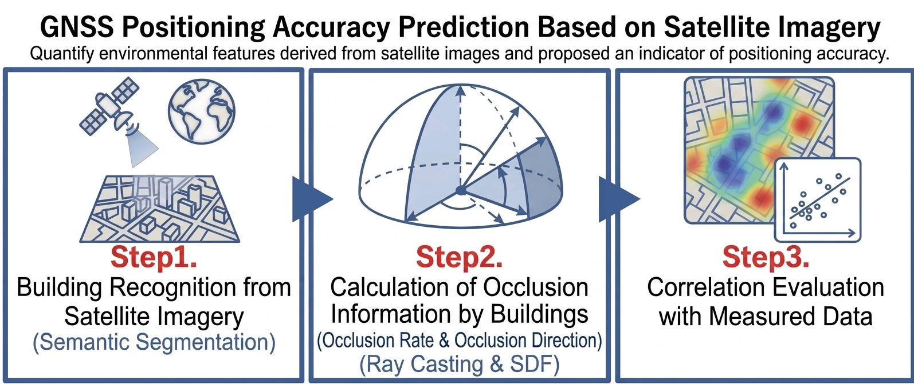

Keyword : `GNSS` `RTK/CLAS測位` `移動ロボット` `車両制御` `センサフュージョン` `経路計画` `シミュレーション`

### Presentations & Publications

- **日本機械学会 ロボティクス・メカトロニクス講演会 2024**  
  "[CLAS測位の誤差の統計的解析と移動ロボットへの実装](https://www.jstage.jst.go.jp/article/jsmermd/2024/0/2024_1A1-J10/_article/-char/ja/)", 2024.05

- **日本機械学会 関東支部栃木ブロック研究交流会 2024**  
  "GNSS測位における直線運動での変位の分析", 2024.10

- **日本機械学会 関東支部 第31期総会・講演会**  
  "[GNSS測位精度の速度依存性及び衛星画像に基づく測位精度の予測](https://www.jstage.jst.go.jp/article/jsmekanto/2025.31/0/2025.31_04G19/_article/-char/ja/)", 2025.03

---

## Projects

### 1. GNSS/QZSS ロボットカーコンテスト

[公式サイト](https://robot-car.jimdofree.com) / [内閣府みちびき公式 2023開催報告](https://qzss.go.jp/events/robotcar_231127.html) / [内閣府みちびき公式 2024開催報告](https://qzss.go.jp/events/robotcar_241209.html)

<table>
  <tr>
    <td rowspan="2" align="center">
      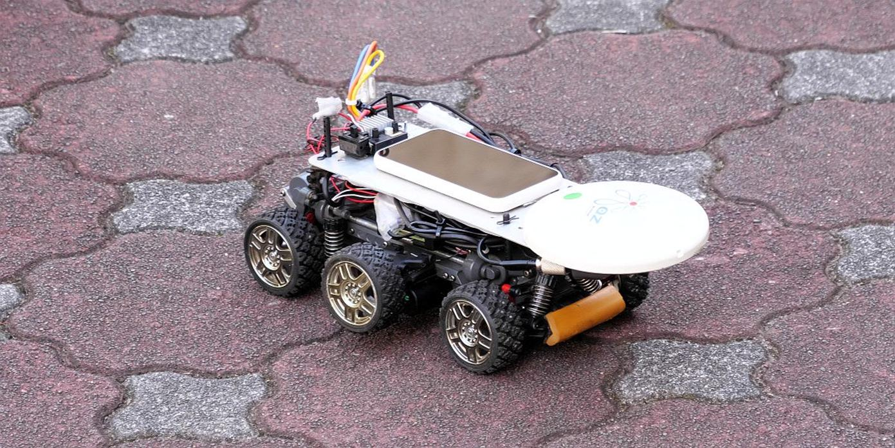 
      作製したラジコンカー
    </td>
    <td align="center">
      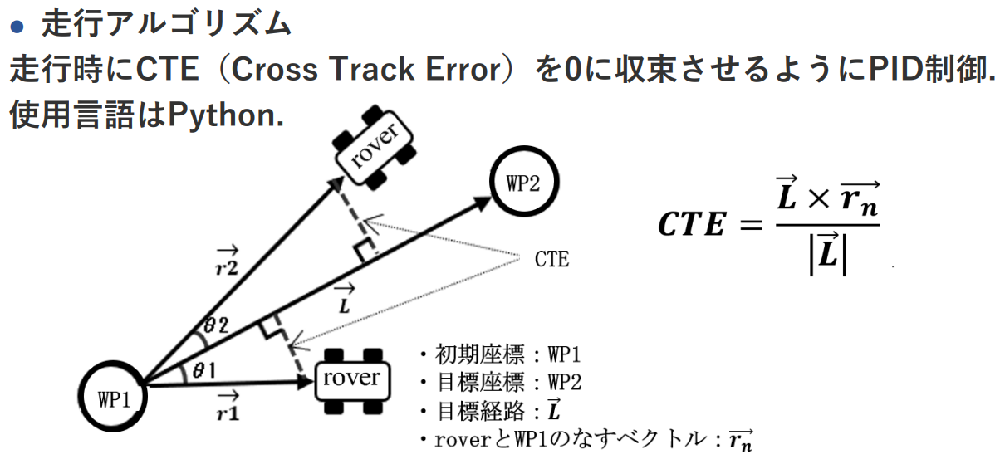 
    </td>
    <td align="center">
      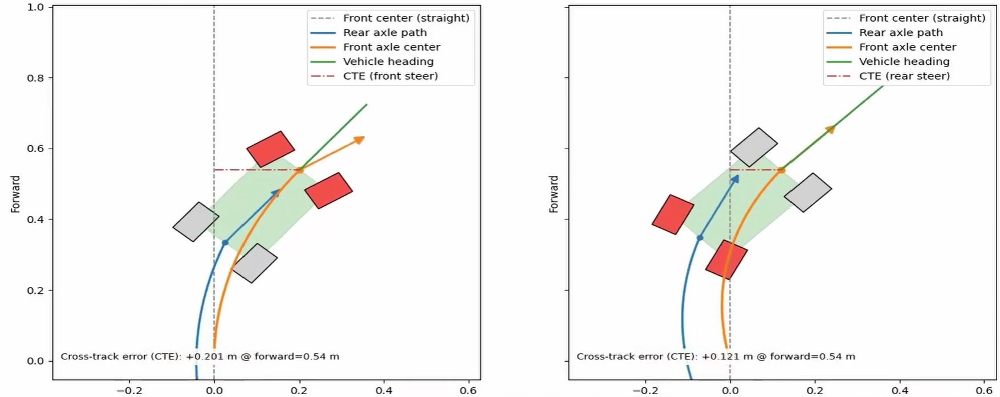 
    </td>
  </tr>
  <tr>
    <td align="center">
      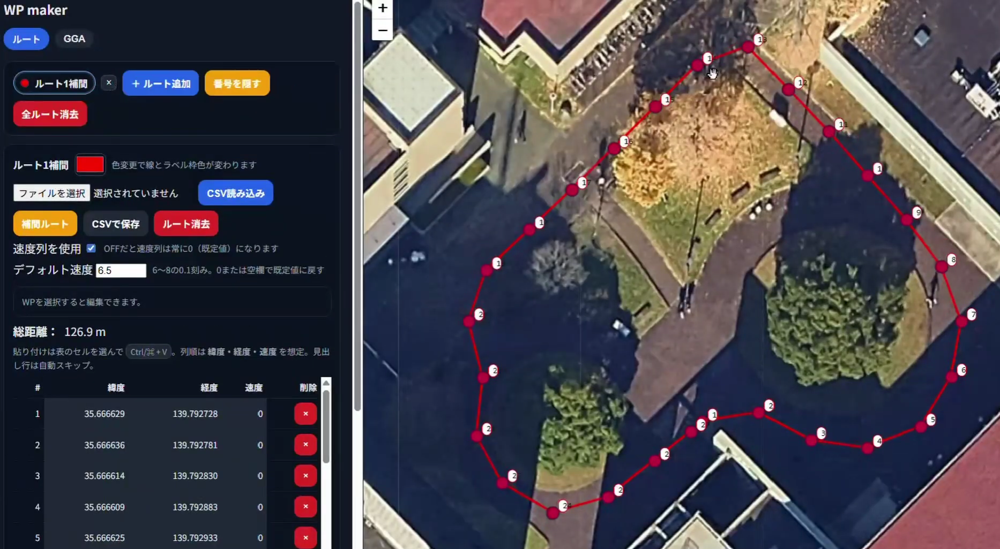 
    </td>
    <td align="center">
      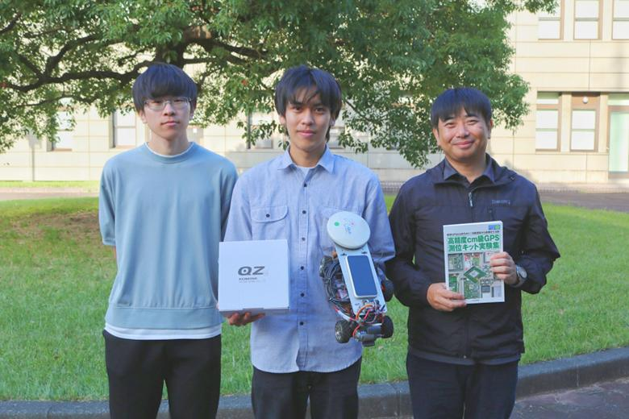 
    </td>
  </tr>
</table>

**概要：**  
　測位航法学会が主催する、GNSS のみでロボットを自律移動させるコンペティションに参加しました。  
　約 10 校の大学・高専が参加する中、**大会 2 連覇**を達成しました。

▶ [GNSSコンテスト2023-2025 まとめ動画(後輩向けに作成)](https://youtu.be/MfBINPeeWks)

**担当（個人参加）：**

- 自律移動ロボット車体の設計・製作
- 自律移動のための走行アルゴリズム実装
- 走行経路生成・調整機能と UI の実装
- 実機検証とパラメータ調整

**使用技術：**

- GNSS 高精度測位（RTK / CLAS 測位）
- Python によるマイコン制御（Raspberry Pi）
- 走行アルゴリズム（Stanley 法・Pure Pursuit 法、PID 制御）
- 速度制御（PWM）

### 2. つくばチャレンジ

[つくばチャレンジ2025公式サイト](https://tsukubachallenge.jp/2025/)

<table>
  <tr>
    <td align="center">
      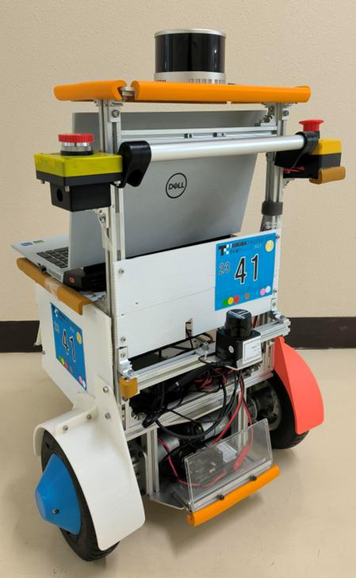 
      作製した自律移動ロボット
    </td>
    <td align="center">
      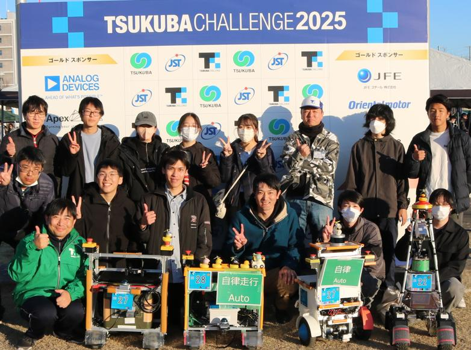 
      つくばチャレンジ 2025 参加時の写真
    </td>
    <td align="center">
      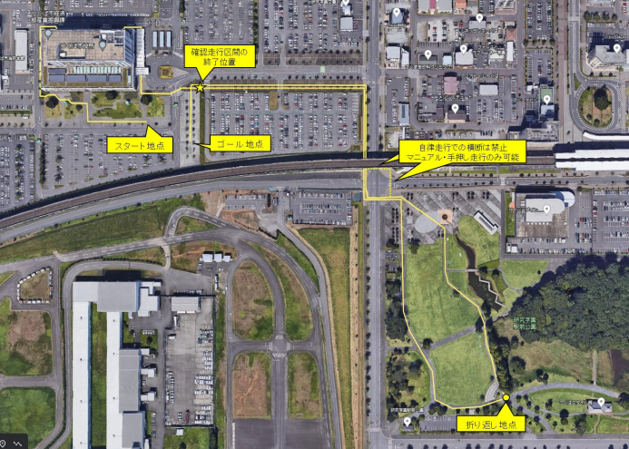 
      つくばチャレンジ2025コース
    </td>
  </tr>
</table>

**概要：**  
　共同研究を兼ねて、つくば市内の街中を約 2 km 自律移動する実証実験・技術交流の場に参加しました。 
　完走はできませんでしたが、約 1 km の自律移動を達成しました。
 
**チーム内での担当：**

- OSS を組み込んだシステム設計と、ロボット仕様に応じた調整
- 信号機・文字認識のための画像処理
  - ▶ [文字認識](https://youtu.be/9_HxP4h3-To)
  - ▶ [信号認識 1](https://youtu.be/RLnf10WMPsA)
  - ▶ [信号認識 2](https://youtu.be/iMxVMhPSoOs)

**使用技術：**

- GNSS、IMU、エンコーダ、LiDAR のセンサフュージョン
- 画像認識モデルを用いた信号機・文字認識
- セマンティックセグメンテーションを活用したアノテーション
- 自律走行シミュレーション

---

## Awards

| Year | Award | Link |
|---|---|---|
| 2024 | GNSS/QZSS ロボットカーコンテスト 2024 **最優秀賞** | [大会結果](https://robot-car.jimdofree.com/%E3%82%A2%E3%83%BC%E3%82%AB%E3%82%A4%E3%83%96/2024%E5%B9%B4/2024%E5%B9%B4-%E5%A4%A7%E4%BC%9A%E7%B5%90%E6%9E%9C/) / [開催報告](https://qzss.go.jp/events/robotcar_241209.html) |
| 2023 | GNSS/QZSS ロボットカーコンテスト 2023 **優勝** | [大会結果](https://robot-car.jimdofree.com/%E3%82%A2%E3%83%BC%E3%82%AB%E3%82%A4%E3%83%96/2023%E5%B9%B4/2023%E5%B9%B4-%E5%A4%A7%E4%BC%9A%E7%B5%90%E6%9E%9C/) / [開催報告](https://qzss.go.jp/events/robotcar_231127.html) |
| 2022 | 第27回 かわさきロボット競技大会 **協育賞** | [大会結果](https://kawasaki-sanshinkaikan.jp/robo/robo_old/robo22/27th/battle/results.html) |

---

## Skills

**● Programming / Tools：**  
`Python` `C++` `MATLAB` `ROS` `Git / GitHub` `Raspberry Pi` `Arduino` `SPRESENSE` `M5Stick`

ROS上でPython / C++ を用いた自律移動ロボットのシステム構築を行った。SPRESENSE は IMU による自己位置推定、Raspberry Pi・Arduino は電動車椅子・歩行ロボットなどの試作や制御、M5Stick は個人の試作・小規模な電子工作で使用。

**● Technologies：**  
`GNSS` `RTK / CLAS` `センサフュージョン` `PID制御` `PWM` `TCP/UDP` `レイキャスティング` `SDF`  
`セマンティックセグメンテーション` `物体認識` `OCR` `主成分分析`

GNSS は研究での測位精度解析と GNSS/QZSS ロボットカーコンテストの自律走行に使用。走行アルゴリズムでは Stanley 法、Pure Pursuit 法、PID 制御を扱った。  
レイキャスティング・SDFは研究において、環境がGNSS測位精度にあたえる影響を定量化し、指標を提案するために活用。

**● Manufacturing：**  
`CAD` `3Dモデリング` `3Dプリント` `機械加工`

CAD は日常的な部品設計、特にプロトタイプ・外装部品（フェンダーなど）の 3D プリントに使用。部品同士の干渉確認やリンク機構の動作確認およびシミュレーションに活用。機械加工では、旋盤、コンターマシン、研削機、ワイヤーカット、レーザー加工機、マシニングセンタなどを使用。

---

## Profile

**Hobbies：**

- **モノづくり:** 部活動では「かわさきロボット競技大会」に出場するために、リンク機構の 4 足ロボットを作製しました。
- **バイク:** ツーリングに行くのが好きです。最近では蔵王の御釜、群馬県の赤城神社に行きました。
- **スポーツ全般:** 中学・高専ではバドミントン部に所属していました。最近はボルダリングにハマっています。

<table>
  <tr>
    <td align="center">
      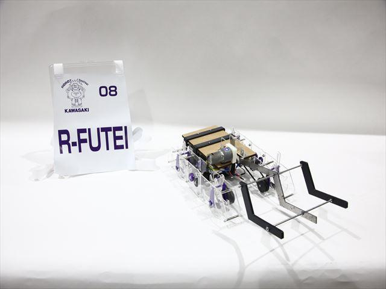 
      かわさきロボット競技大会の機体
    </td>
    <td align="center">
      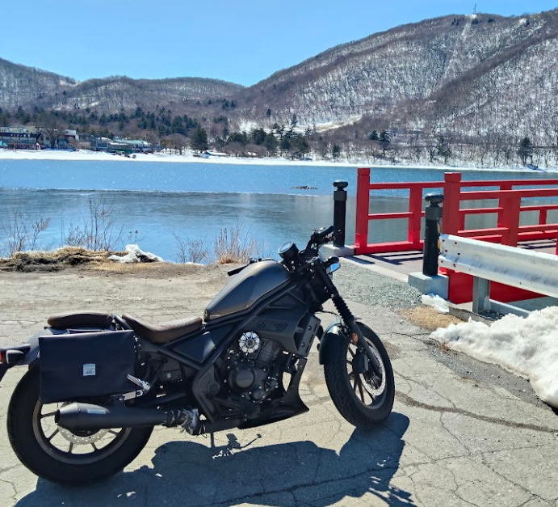 
      愛車Rebel250
    </td>
     <td align="center">
      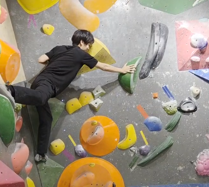 
      最近ハマっているボルダリング
    </td>
  </tr>
</table>

**Qualifications：**  
空手初段 / 基本情報技術者試験 / TOEIC 810 / 普通自動車第一種運転免許 / 普通自動二輪車免許

**Special Skills：**  
空手（11年間、全国大会準優勝経験） / キックボクシング（5年間）

**Activities**

| Category | Activities |
|---|---|
| 留学 | シンガポール留学（研究室配属 1 か月） |
| 部活動 | バドミントン（中学・高専） / かわさきロボット研究愛好会（高専） |
| アルバイト | TA / 県南ゼミ講師（自校学生への指導） / 家庭教師 |

---

## Contacts

**Email：** <kagayaryuji1209@gmail.com>
